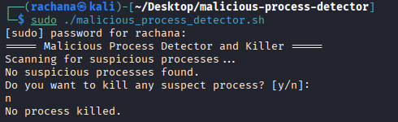

# Process Threat Management System

A self-initiated Linux project to understand process monitoring and basic threat detection using Bash scripting.

---

## About the Project

This project was built independently to learn Linux process management, CPU usage monitoring, and basic incident-response concepts.  
It identifies suspicious processes and allows controlled termination with user confirmation.

---

## Key Features

- Linux process scanning
- CPU usage threshold-based detection
- Suspicious process name matching
- Manual confirmation before termination
- Root privilege validation

---

## Technologies Used

- Bash scripting
- Linux OS
- `ps` and `kill`

---

## Project Structure

Process-Threat-Management-System/

~~~
├── README.md
├── docs/
├── linux/
└── screenshots/
~~~

---

## How to Run

```bash
1️⃣ Go to project directory
    cd Process-Threat-Management-System

2️⃣ Give execute permission to the script
    chmod +x malicious_process_detector.sh

3️⃣ Run the script
    sudo ./linux/malicious_process_detector.sh

Root access is required for full process visibility.
```

## Screenshots

### Linux Process Scan Output
This screenshot shows the execution of the process detection script on a clean system.




## Documentation

Detailed notes are available in the docs/ folder.

## Future Enhancements

Windows implementation using PowerShell

## Author

Rachana S Shekar
Self-initiated cybersecurity learner
M.E in Cybersecurity | B.E in ECE